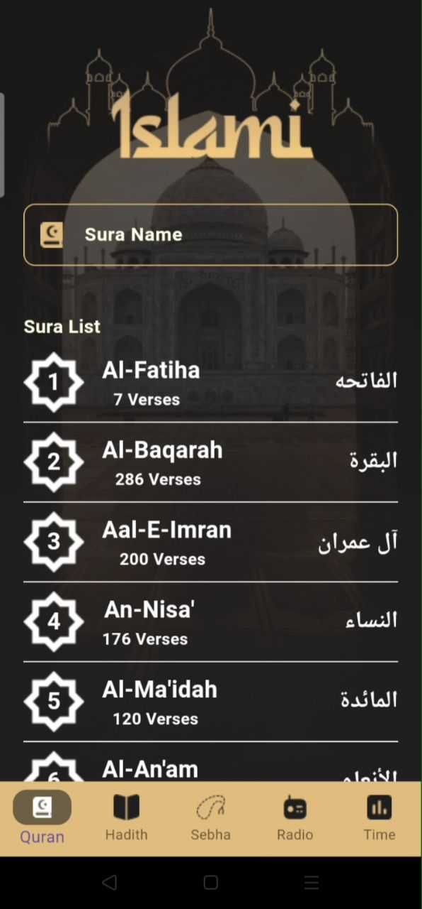
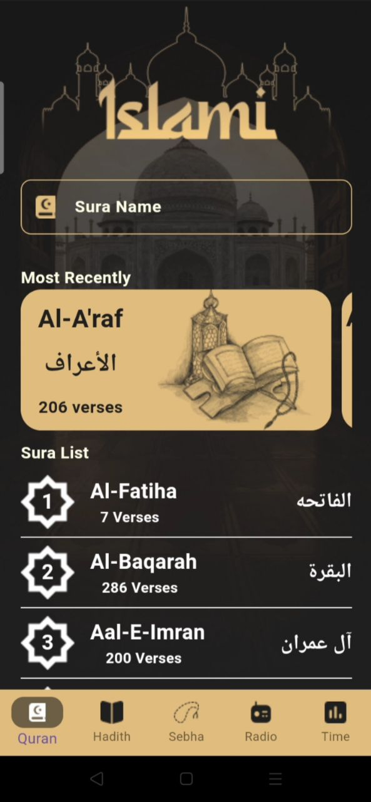

# Islami App

Islami App is a Flutter mobile application that provides essential Islamic content in a clean and simple interface.

## Technologies Used
- Flutter
- Dart
- Shared Preferences (for local caching)
- Local File Reading (assets)

## Features
- Splash Screen on app start
- Onboarding screens for first-time users
- Read Quran Surahs
- Read Hadiths
- Digital Tasbeeh
- Offline content using cache
- Responsive UIResponsive UI

## Screenshots

  
  
  
  
  

## Data Management
- Content is read from local files
- Shared Preferences is used to cache user data for better performance

## Getting Started

### Prerequisites
- Flutter SDK
- Android Studio or VS Code

